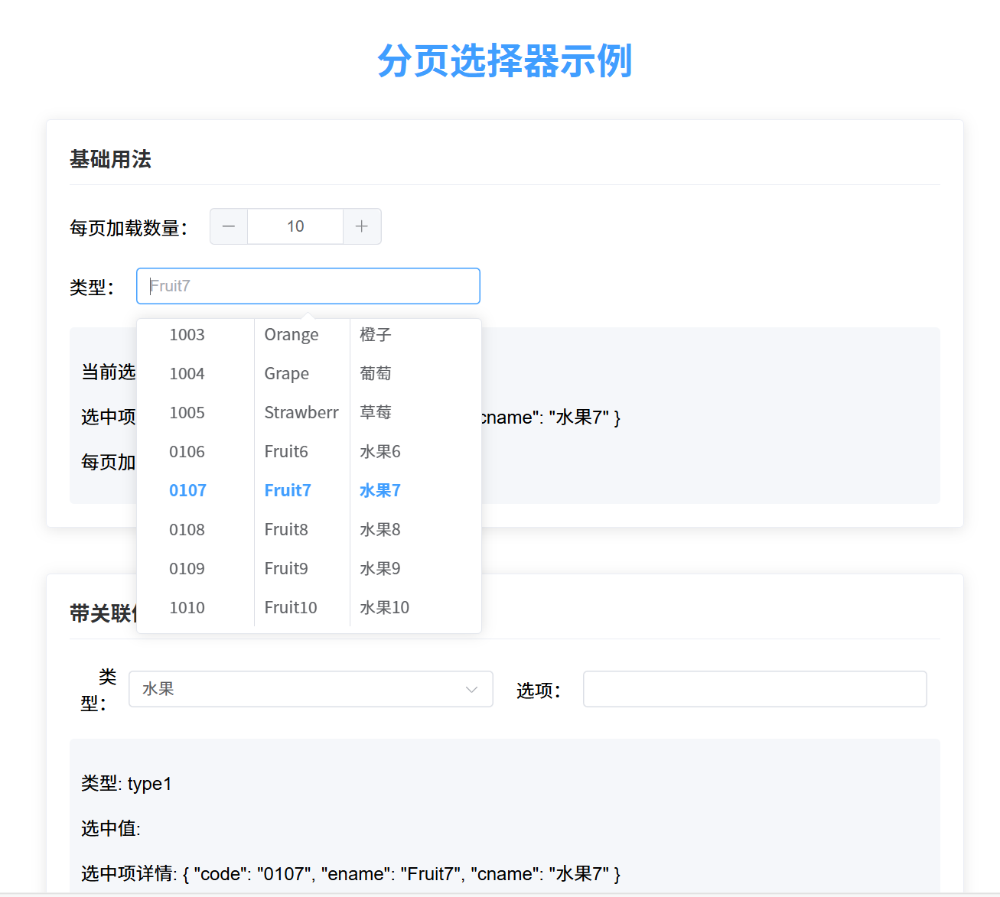

# Paging Select 分页选择器

一个基于 Element Plus 的支持分页加载的选择器组件，可用于大数据量的下拉选择场景。


## 特性

- 支持分页加载选项，滚动到底部自动加载更多
- 支持搜索过滤
- 支持关联值联动
- 自定义样式显示代码、英文名和中文名
- 与Element Plus样式完全一致
- 支持动态调整每页加载数量
- 优化的滚动加载机制，适用于大数据量场景

## 安装

```bash
npm install paging-select element-plus vue
```

## 使用方法

### 基础使用

```vue
<template>
  <PagingSelect
    v-model="selectedValue"
    :get-option-fn="fetchOptions"
    @setRelatedValue="handleSetRelated"
  />
</template>

<script setup>
import { ref } from 'vue'
import PagingSelect from 'paging-select'

const selectedValue = ref('')

// 获取选项的函数，需要返回包含list和total的Promise
const fetchOptions = (params) => {
  const { page, limit, searchKey } = params
  // 调用API获取数据
  return api.getOptions({ page, limit, keyword: searchKey })
}

// 处理选中项
const handleSetRelated = (item) => {
  console.log('选中项：', item)
}
</script>
```

### 带关联值的使用

```vue
<template>
  <el-form>
    <el-form-item label="类型">
      <el-select v-model="typeValue" @change="handleTypeChange">
        <el-option
          v-for="item in typeOptions"
          :key="item.value"
          :label="item.label"
          :value="item.value"
        />
      </el-select>
    </el-form-item>
    
    <el-form-item label="选项">
      <PagingSelect
        v-model="selectedValue"
        :get-option-fn="fetchOptions"
        :related-key="typeValue"
        @setRelatedValue="handleSetRelated"
      />
    </el-form-item>
  </el-form>
</template>

<script setup>
import { ref } from 'vue'
import PagingSelect from 'paging-select'

const typeValue = ref('type1')
const selectedValue = ref('')

const typeOptions = [
  { value: 'type1', label: '类型1' },
  { value: 'type2', label: '类型2' }
]

// 获取选项的函数，根据关联值返回不同数据
const fetchOptions = (params) => {
  const { page, limit, searchKey, relatedKey } = params
  // 调用API获取数据，传入关联值
  return api.getOptions({ page, limit, keyword: searchKey, type: relatedKey })
}

// 处理类型改变
const handleTypeChange = () => {
  selectedValue.value = ''
}

// 处理选中项
const handleSetRelated = (item) => {
  console.log('选中项：', item)
}
</script>
```

## API 接口说明

### getOptionFn 返回数据格式

组件的 `getOptionFn` 属性需要返回一个带有以下结构的 Promise：

```javascript
{
  list: [
    { code: '1001', ename: 'Item 1', cname: '项目1' },
    { code: '1002', ename: 'Item 2', cname: '项目2' },
    // ...更多选项
  ],
  total: 100 // 总记录数，不是总页数
}
```

组件会根据 `total` 和 `pageSize` 自动计算总页数，并决定是否继续加载更多数据。

## 组件属性

| 属性名       | 类型     | 默认值     | 说明                           |
|-------------|----------|-----------|--------------------------------|
| modelValue  | String   | -         | 绑定值，使用v-model指令         |
| width       | String   | 100%      | 选择器宽度                      |
| getOptionFn | Function | -         | 获取选项的函数，必填            |
| searchKey   | String   | searchKey | 搜索关键字参数名                |
| relatedKey  | String   | -         | 关联值，变更时会重置选择器      |
| placeholder | String   | -         | 占位文本                        |
| disabled    | Boolean  | false     | 是否禁用                        |
| filterable  | Boolean  | true      | 是否可搜索                      |
| remote      | Boolean  | true      | 是否为远程搜索                  |
| clearable   | Boolean  | false     | 是否可清空选项                  |
| noMatchText | String   | -         | 无匹配选项时显示的文本          |
| noDataText  | String   | -         | 无数据时显示的文本              |
| pageSize    | Number   | 20        | 每页加载的选项数量，变更时会重置分页 |

## 事件

| 事件名             | 说明                            | 回调参数                |
|-------------------|--------------------------------|------------------------|
| update:modelValue | 更新组件绑定的值                | 选择器绑定的值 (String) |
| setRelatedValue   | 选中某个选项时触发              | 当前选中项 (Object)     |
| clear             | 清空选择器时触发                | -                      |

## 技术实现

### 滚动加载实现原理

1. 组件使用自定义指令 `v-loadmore` 监听选择器下拉列表的滚动事件
2. 当滚动到距离底部 5px 范围内时，触发加载更多数据的函数
3. 使用 `hasMoreData` 状态跟踪是否还有更多数据可加载
4. 在每次加载后，根据返回数据判断是否已加载完所有数据

### 性能优化

1. 避免重复加载：使用 `loading` 状态防止并发加载请求
2. 灵活数据适配：支持不同格式的后端返回数据（总记录数或总页数）
3. 动态页面大小：可以根据需要调整每页加载的数量，并自动重置分页

## 开发

```bash
# 安装依赖
npm install

# 运行开发环境
npm run dev

# 构建库
npm run build

# 运行测试
npm run test
```

## 许可证

ISC 